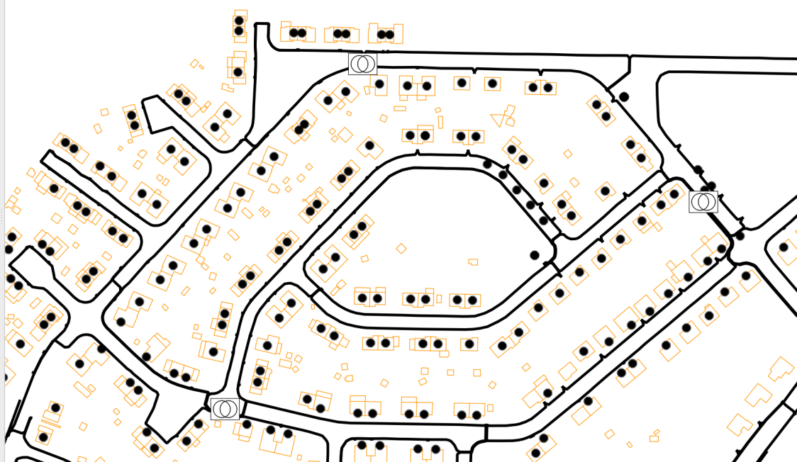
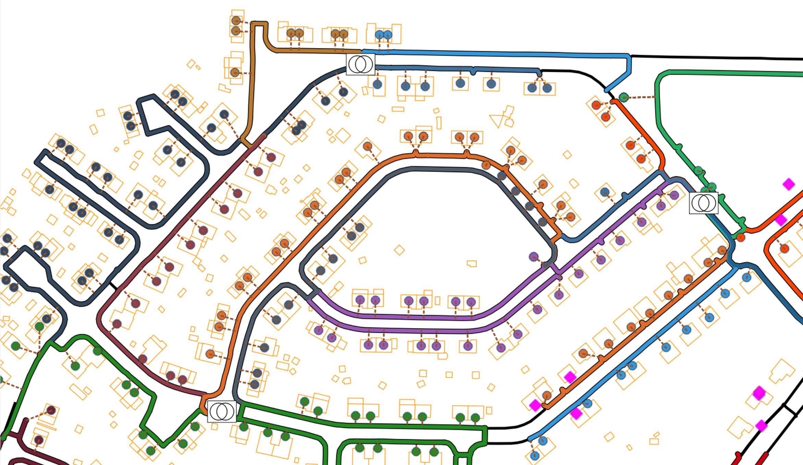

# Electrical Distribution Network Topological Path Identification (TPI)

This repository contains the code and data used for the identification of customer topological paths in electrical distribution networks. The methodology employs geographic information system (GIS) data and integer linear programming (ILP) optimization to estimate paths from the MV/LV transformer to customers.

For more detailed information, refer to the paper [here](https://orbi.uliege.be/handle/2268/321834).

## Table of Contents

- [Introduction](#introduction)
- [Required Data](#requireddata)
- [Usage](#usage)
- [Results](#results)

## Introduction

Topological path identification (TPI) is crucial for the digitalization, analysis, and planning of electrical distribution networks. This repository presents an innovative approach to tackle the challenge of TPI using only the data available to distribution system operators (DSOs).


## Required Data
The folder \Data contains all the data required to run the methodology and indentifiying the customer topological paths.  
In paritcular the required data is:
- the name of the elements
- their type (customer, line, ...)
- their location
- for customers, the terminal point which they are supplied by (terminal point can be anything actually. It can be the transformer or the feeder junction, as in this case)

## Usage

To run the TPI process, follow these steps:

1. Clone the repository:
   ```bash
   git clone https://github.com/TPIproblem/OptimalTPI.git
   cd OptimalTPI

2. Install the required packages:
   ```bash
   pip install -r requirements.txt

3. Run main notebook script:
   ```bash
   Optimal TPI.ipynb

## Results
<table>
  <tr>
     <td> Network before applying the methodology </td>
     <td> Network after applying the methodology </td>
  </tr>
  <tr>
    <td>  </td>
    <td>  </td>
  </tr>
 </table>
Figure above shows a part of the Belgian network considered with three MV/LV transformers, some lines, and customers.
In the right figure it is possible to see the network after the identification of the paths: colors have been assigned to customers and lines belonging to the same feeder terminal junction. Dashed lines represent the connections between the elements, for example, customer-line connections.

***

For any questions or issues, please contact mvassallo@uliege.be.
